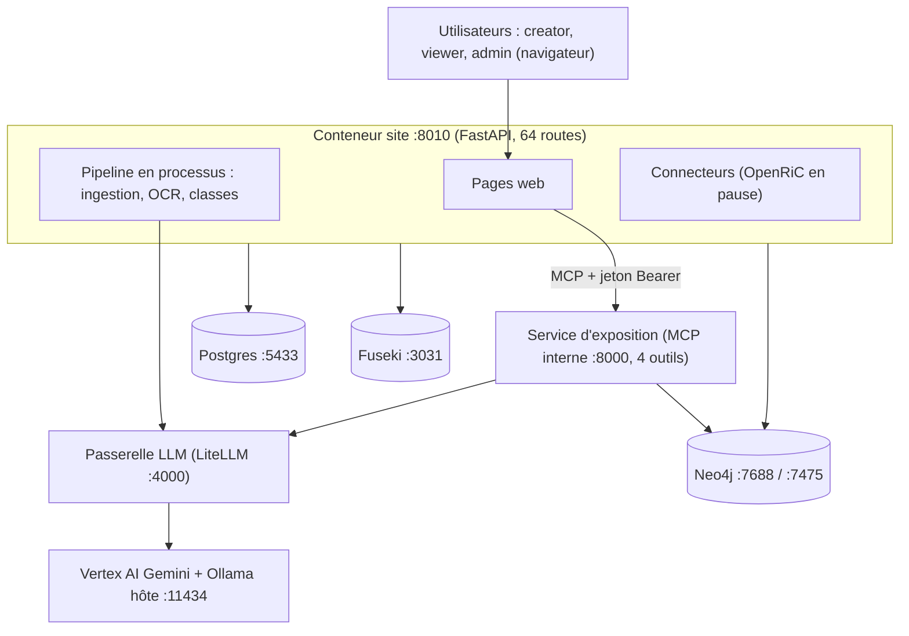

# Architecture globale d'IAFActory

État relevé le 2026-10-03 (soir). Les ports hôte sont ceux de cette machine (`.env`), tous liés à `127.0.0.1`. **Au moment du relevé Docker Desktop était arrêté : aucun conteneur ne tournait** (API Docker injoignable, ports 8010, 4000, 3031, 5433 et 7688 fermés). Ce document décrit ce qui a été vérifié en marche dans la journée.

Remplace [architecture.md](architecture.md) (version initiale) et complète [design/conception.md](design/conception.md) et l'[ADR 0009](adr/0009-services-agentises.md).

## Schéma

## Services et points d'accès

| Service | Technologie | Accès | Qui l'appelle | Ce qu'il fait |
|---|---|---|---|---|
| Site | FastAPI, Python 3.13 | `http://127.0.0.1:8010` | navigateurs | pages, authentification par cookie signé, pipeline en processus |
| Service d'exposition | MCP Streamable HTTP, Python 3.13 | `http://exposition:8000/mcp` (réseau interne, aucun port hôte) ; `/healthz` ouvert | le site seulement | lecture des connaissances, réponse ancrée |
| Passerelle LLM | LiteLLM 1.98.0 + jev-router | `http://127.0.0.1:4000` ; `/v1/chat/completions`, `/v1/embeddings`, `/health/readiness`, `/ui` | site, exposition | route les appels de modèles ; jeton `LITELLM_MASTER_KEY` |
| Neo4j 5.26 (apoc, n10s) | bolt `127.0.0.1:7688`, navigateur `127.0.0.1:7475` | login `neo4j` | site, exposition | graphe : classes, concepts, entités, documents, chunks, index vectoriel `chunkEmbeddings` (768 dimensions) |
| Postgres 17 | `127.0.0.1:5433` | identifiants `.env` | site | comptes, documents, exécutions et étapes du pipeline, paramètres, connecteurs et journal d'audit |
| Fuseki (Jena 6.2.0) | `127.0.0.1:3031`, jeu de données `iaf` : `/iaf/sparql`, `/iaf/update`, `/iaf/data`, `/$/ping` | identifiants `.env` | site | ontologies OWL par classe, propriétés partagées, taxonomies SKOS, ontologies structurelles |
| `neo4j-init` | conteneur ponctuel | aucun | compose | crée les index et contraintes puis s'arrête |
| Ollama (hôte, hors compose) | `http://host.docker.internal:11434` | aucun | passerelle | embeddings `nomic-embed-text` (alias `iaf-embedding`) |
| Ollama, Loki, Grafana (conteneurs) | profils `llm` et `observability` | non démarrés par défaut | | inertes (observabilité codée mais inactive) |

Volume `site_documents` (`/data/documents`) : fichiers déposés, indexés par sha256. Réseaux : un seul réseau par défaut ; `compose.secure.yaml` sépare `data` (interne, sans sortie) et `edge`.

## API du site (64 routes)

| Zone | Routes | Rôle |
|---|---|---|
| `/login`, `/logout`, `/`, `/healthz` | 5 | session, tableau de bord, sonde de santé |
| `/knowledge`, `/knowledge/classes/{id}` | 2 | connaissances, recherche et réponse ancrée (viewer et creator) |
| `/ask` | 2 | question libre (viewer, creator, admin) |
| `/creator/documents*` | 8 | dépôt unique ou en lot, détail, téléchargement, relance, suppression |
| `/creator/classes*`, `/creator/corpus*` | 20 | classes, ontologies (ttl, owl, structurelles), fusion, promotion, réduction, corpus |
| `/creator/taxonomy*`, `/creator/taxonomies*` | 8 | vocabulaire, taxonomies SKOS (export ttl, owl) |
| `/creator/processes`, `/creator/settings` | 3 | suivi des traitements, paramètres et connecteurs |
| `/creator/connectors*` | 7 | registre de connecteurs (création, activation, synchronisation, révocation) |
| `/admin/users*`, `/admin/archive*`, `/admin/wipe`, `/admin/connectors*` | 9 | comptes, archivage, effacement, approbation des connecteurs |

## Service d'exposition : outils MCP

`ask_knowledge(question, caller_role)`, `search_knowledge(query, caller_role)`, `list_classes(caller_role)`, `get_class(class_id, caller_role)`. Jeton Bearer `EXPOSITION_TOKEN` obligatoire (le service refuse de démarrer sans). Rôles acceptés : `viewer` (classes officielles) et `creator` (tout) ; l'admin est traité comme viewer.

## Modèles (via la passerelle)

| Alias utilisé par le code | Fournisseur | Usage |
|---|---|---|
| `gemini-vertex-flash` | Vertex AI (compte de service) | extraction de vocabulaire, d'entités et de relations, OCR par vision, explication des réponses |
| `iaf-embedding` | Ollama sur l'hôte, `nomic-embed-text` | embeddings des chunks, des concepts et des questions |
| `claude-*`, `iaf-extraction`, `iaf-agent`, `iaf-judge`, `gemini-flash/pro` | Anthropic, Gemini API | déclarés dans `litellm.yaml`, **inutilisables aujourd'hui** (aucune clé `ANTHROPIC_API_KEY` ni `GEMINI_API_KEY`) |

## Flux

1. **Dépôt** : navigateur, site (`/creator/documents/new`), fichier sur le volume, file du `ThreadPoolExecutor`, analyse structurelle (OCR si page scannée), chunks et embeddings (passerelle, Ollama), vocabulaire et entités (passerelle, Gemini), écriture Neo4j et Fuseki, état dans Postgres, puis cycle de vie des classes (fusion, promotion).
2. **Question ou recherche** : navigateur, site, service d'exposition (MCP), Neo4j (voie graphe, voie vectorielle), passerelle (embedding de la question, explication), réponse avec preuves ou aveu d'ignorance.
3. **Connecteur** : un connecteur approuvé par l'admin alimenterait le même chemin que le dépôt manuel. Aucun n'est actif (OpenRiC en pause, Google Drive retiré).

## Agents : ce qui existe réellement

Il n'y a **aucun agent autonome piloté par un modèle**. Ce qui existe :
- le **service d'exposition**, seul « agent » déployé : serveur MCP à récupération déterministe, qui n'appelle le modèle que pour expliquer des données déjà retenues ;
- l'**ingestion** et la **structuration**, qui sont des pipelines déterministes **dans le conteneur du site** (décision du 2026-10-03 : pipelines déterministes, à extraire en deux conteneurs MCP, ADR 0009) ;
- le modèle est un **outil** appelé par ces pipelines, jamais un planificateur.

Le runtime d'agents de projet (EPIC-IAF-E4, sessions, budgets) n'est pas réalisé.

## Processus en arrière-plan

Dans le site : un `ThreadPoolExecutor` pour le pipeline (un document à la fois par fil), un pool de 4 fils pour l'OCR, et les traitements qui suivent chaque ingestion (cycle de vie des classes, comparaison de classes). Aucun planificateur périodique ni service de file séparé (la file Postgres de l'ADR 0006 n'est pas réalisée).

## Outils en ligne de commande (hors services)

`site/scripts/` : `create_admin.py`, `create_class.py`, `replay_learning.py`, `generate_*` (documents de test), `fill_definitions_wordnet.py`, `wipe_data.py`, etc. Ils se connectent directement aux magasins depuis l'hôte.

## Points de fragilité connus

- **Embeddings hors compose** : tout dépend d'Ollama sur l'hôte (`host.docker.internal:11434`). S'il est arrêté, l'ingestion et la recherche vectorielle échouent. Au moment du relevé, des processus `OllamaSetup` étaient en cours sur la machine.
- **Le site détient les identifiants des trois magasins** (US19.8, segmentation réseau non faite) ; `documents.py` et `admin.py` ouvrent encore Neo4j et Fuseki directement.
- **Fournisseur unique en pratique** : Vertex AI (Gemini) porte l'extraction, l'OCR et les explications ; les images de pages OCR lui sont envoyées.
- **Secrets** : `.env` local (non commité), compte de service Vertex en fichier ; pas de coffre, pas de rotation de la clé maître des connecteurs.
- **Aucun TLS** (ports liés à `127.0.0.1` seulement) ; exposition protégée par jeton, rôle transmis par le site non prouvé cryptographiquement.
- **Reprise** : un traitement `running` au redémarrage du site reste bloqué (pas de reprise automatique).
