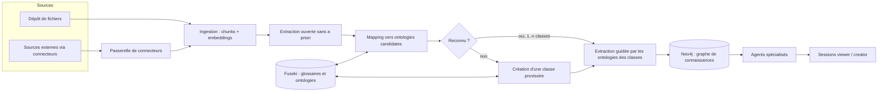

# Conception v2 : classification documentaire, agents spécialisés, sessions

Statut : proposition du 2026-09-26, issue des précisions de l'utilisateur. Les seuils et choix d'algorithmes sont des hypothèses à mesurer (voir IAF-E7 US7.7). Remplace la vue d'ensemble de [architecture.md](../architecture.md).

## 1. Vocabulaire

| Terme | Sens dans IAFActory |
|---|---|
| Glossaire métier | Ensemble de termes d'un domaine (SKOS ConceptScheme). Organise les ontologies. |
| Ontologie | Classes OWL et propriétés d'un domaine, rattachées à un glossaire. |
| Classe documentaire | Type de document (ex. contrat, fiche technique). Porte une ontologie. À ne pas confondre avec une classe OWL. |
| Schéma du document | Types d'entités et de relations extraits d'un document sans a priori. |
| Reconnu | Le schéma du document est suffisamment couvert par une ou plusieurs classes documentaires connues. |
| Spécialité | Ensemble de classes documentaires (et glossaires) qu'un agent maîtrise. |
| Session | Conversation d'un utilisateur (viewer ou creator) avec un agent. |
| Connecteur | Accès configuré à une source externe de documents. |

## 2. Vue d'ensemble

## 3. Modèle de données

Postgres (transactionnel) : utilisateurs, rôles, projets, exclusions viewer, agents et versions, spécialités d'agent, sessions et messages, connecteurs et secrets chiffrés, journal d'audit.

Neo4j (graphe de connaissances) :

- `(:Document)-[:HAS_CHUNK]->(:Chunk)` avec provenance (page, position) et embedding.
- `(:Document)-[:IN_CLASS {score, coverage, method, version}]->(:DocumentClass)` : plusieurs classes possibles par document.
- `(:DocumentClass {status})` avec `status` parmi `provisoire`, `validee`, `rejetee`.
- `(:DocumentClass)-[:USES_ONTOLOGY]->(:Ontology)`, `(:Ontology)-[:ORGANISED_BY]->(:Glossary)`.
- `(:Chunk)-[:MENTIONS]->(:Entity)`, `(:Entity)-[:REL {type}]->(:Entity)`, `(:Entity)-[:INSTANCE_OF]->(:OntologyElement)`.

Fuseki (RDF, source de vérité des ontologies, décision à confirmer dans l'ADR 0002) : un graphe nommé par glossaire, par version d'ontologie et par schéma induit d'un document ou d'une classe provisoire. Import vers Neo4j par n10s.

## 4. Classification : un document est-il reconnu ?

Principe : extraire d'abord sans a priori, puis comparer au connu. Les documents n'ont pas besoin d'être étiquetés par le creator.

1. **Extraction ouverte** : triplets libres, types d'entités et relations propres au document. Approche de référence : EDC (Extract, Define, Canonicalize), qui fonctionne avec ou sans schéma cible et récupère les éléments de schéma pertinents pour limiter la taille du prompt ([arXiv 2404.03868](https://arxiv.org/abs/2404.03868)). Sortie : schéma du document `Sd`, chaque élément `e` pondéré par sa fréquence normalisée `w_e`.
2. **Pré-filtrage** des classes candidates (top-k) : comparaison bon marché de `Sd` avec chaque classe.
3. **Mapping fin** de `Sd` vers l'ontologie de chaque classe candidate : correspondances élément par élément.
4. **Décision** multi-classes par couverture (section 4.2).
5. **Non reconnu** : la classe est créée à partir de `Sd` (section 4.3).

### 4.1 Algorithmes de comparaison

Cascade du moins cher au plus précis, chaque étage ne traitant que les survivants du précédent.

| Étage | Algorithme | Rôle | Point faible | Statut de la référence |
|---|---|---|---|---|
| 1 | Jaccard pondéré sur ensembles de termes, accéléré par MinHash + LSH | Pré-filtre en temps quasi constant par paire, sans comparer toutes les paires | Forme de surface seulement, aucune sémantique | Vérifié : documentation datasketch (MinHash, MinHash LSH, LSH Forest pour le top-k) |
| 1 | Similarité cosinus d'embeddings (centroïde de classe vs document) via index vectoriel Neo4j | Pré-filtre sémantique, top-k | Centroïde flou pour une classe hétérogène | Index vectoriel natif Neo4j 5 (ADR 0001) |
| 2 | Appariement d'éléments : lexical (labels, synonymes du glossaire) + embeddings de labels | Correspondances candidates `(e, o)` avec score | Sens du contexte | Approche des systèmes LogMap, AML (lexical puis extension structurelle puis réparation logique) |
| 2 | Appariement neuronal de type BERTMap | Meilleure sémantique que le lexical seul ; annoncé supérieur à LogMap et AML sur des tâches OAEI dans son article | Demande un entraînement ou un fine-tuning | Vérifié : article AAAI |
| 3 | Propagation structurelle (voisins compatibles se renforcent) | Corrige les correspondances ambiguës par la structure du graphe | Coût, sensibilité au bruit | À vérifier (Similarity Flooding, Weisfeiler-Lehman) : non consulté dans cette session |
| 4 | Arbitrage LLM sur la zone grise seulement | Trancher les paires ambiguës | Coût et latence, non déterminisme | LLMs4OM référence cette approche |

Recommandation initiale : étages 1 puis 2 (embeddings + lexical), étage 4 en zone grise, étage 3 seulement si le banc d'évaluation le justifie. Le choix final vient de US7.7, pas de cette table.

### 4.2 Décision de reconnaissance

Pour un document `d` et une classe `C` d'ontologie `O_C` :

- `couverture(d, C) = somme des w_e des éléments de Sd appariés à O_C / somme des w_e`.
- `typicité(d, C) = fraction des éléments centraux de O_C retrouvés dans Sd` (évite qu'une classe très générale « reconnaisse » tout).
- Sélection gloutonne : retenir la classe de meilleure couverture, retirer les éléments couverts, recalculer la couverture résiduelle, continuer tant que le gain dépasse `delta`.
- Reconnu si la couverture cumulée dépasse `tau_union` ; chaque classe retenue exige couverture et typicité minimales.
- Chaque affectation garde son explication : éléments appariés, score, algorithme, version des seuils.
- `tau_*`, `delta` et le seuil d'appariement sont calibrés sur un jeu annoté hors échantillon, jamais sur les documents ayant servi à les régler.

### 4.3 Document non reconnu

1. Le schéma `Sd` est normalisé (canonicalisation, fusion des synonymes) puis publié comme ontologie induite dans un graphe nommé Fuseki.
2. Une classe documentaire `provisoire` est créée, avec un glossaire candidat.
3. Anti-prolifération : avant création, comparaison de `Sd` aux classes provisoires existantes (même cascade) ; si proche, le document rejoint la classe existante.
4. Le creator revoit les classes provisoires : valider, renommer, fusionner, rejeter (US7.6).
5. Un document rejeté ou fusionné est reclassé automatiquement.

## 5. Agents spécialisés

Un agent déclare une **spécialité** : classes documentaires et glossaires. À l'exécution, la recherche est filtrée par :

`classes du document ∩ spécialité de l'agent`, puis par les exclusions du viewer en session, puis par le projet.

Un document multi-classes est utilisable par un agent dès qu'une de ses classes est dans la spécialité ; seules les parties du graphe rattachées à cette classe sont utilisées (les entités portent leur classe d'origine). Un agent sans spécialité n'existe pas : c'est une validation de création.

## 6. Besoin du creator : cadrage guidé

Le creator décrit un besoin ; un assistant de cadrage produit un brouillon d'agent (US8.x) :

1. Reformuler le besoin et le faire valider.
2. Poser les questions manquantes (qui utilise, quelles décisions, quelles sources).
3. Proposer : spécialité (classes existantes ou à créer), sources et accès (connecteurs), tests de validation, approche.
4. Signaler les écarts : classe absente, source non accessible, glossaire manquant.

Le creator garde la main : rien n'est créé sans sa validation.

## 7. Connecteurs sécurisés

Menaces retenues : fuite d'identifiants, SSRF et pivot réseau, exfiltration via le LLM, sur-privilège, contenu hostile dans les documents (injection de prompt). Contrôles :

- Identifiants chiffrés (enveloppe), jamais renvoyés à l'interface ni insérés dans un prompt ; rotation et révocation.
- Portées minimales, lecture seule par défaut.
- Exécution isolée avec sortie réseau limitée à une liste blanche par connecteur ; blocage des adresses internes (SSRF).
- Contenu importé traité comme donnée non fiable : jamais exécuté comme instruction.
- Journal d'audit de chaque lecture et de chaque changement de configuration.
- Réseau : magasins de données non exposés hors du réseau interne (voir `compose.secure.yaml`).

Détail : [ADR 0003](../adr/0003-connecteurs-securises.md).

## 8. Sessions

Viewer et creator ouvrent des sessions avec un agent visible pour eux. Un viewer n'a aucun droit d'écriture sur l'agent ni sur le projet ; ses exclusions filtrent la récupération à chaque tour, pas seulement à l'ouverture de la session. Historique conservé par utilisateur ; règle de visibilité pour le creator à trancher (question ouverte, IAF-E10).

## 9. Matrice des droits (hypothèses)

| Action | viewer | creator (propriétaire) | admin |
|---|---|---|---|
| Voir projets et agents | oui sauf exclusions | oui (les siens) | oui |
| Ouvrir une session avec un agent | oui, si non exclu | oui | oui |
| Créer/modifier agent, tests, connecteurs, classes | non | oui | non (sauf arrêt et effacement) |
| Poser des exclusions | non | oui, sur ses projets | non |
| Créer un creator | non | non | oui |
| Arrêter/effacer un projet | non | non | oui, tous |

## 10. Questions ouvertes

1. Les glossaires et ontologies sont-ils partagés entre projets (bibliothèque commune) ou propres à chaque projet ? Impact direct sur qui voit une classe créée automatiquement.
2. Quelles sources externes faut-il brancher en premier (SharePoint, Confluence, dépôts, bases) ? Détermine US9.5.
3. Fournisseur LLM et données autorisées à sortir (documents envoyés à une API externe ou modèle local) ?
4. Volumétrie : nombre de documents, de classes, d'agents, d'utilisateurs simultanés.
5. Le creator voit-il les sessions des viewers ?
6. Langues des documents.
