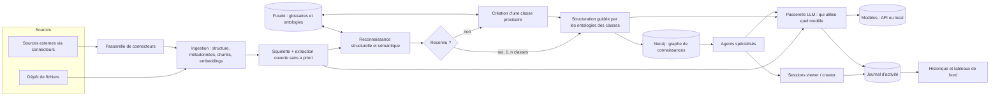
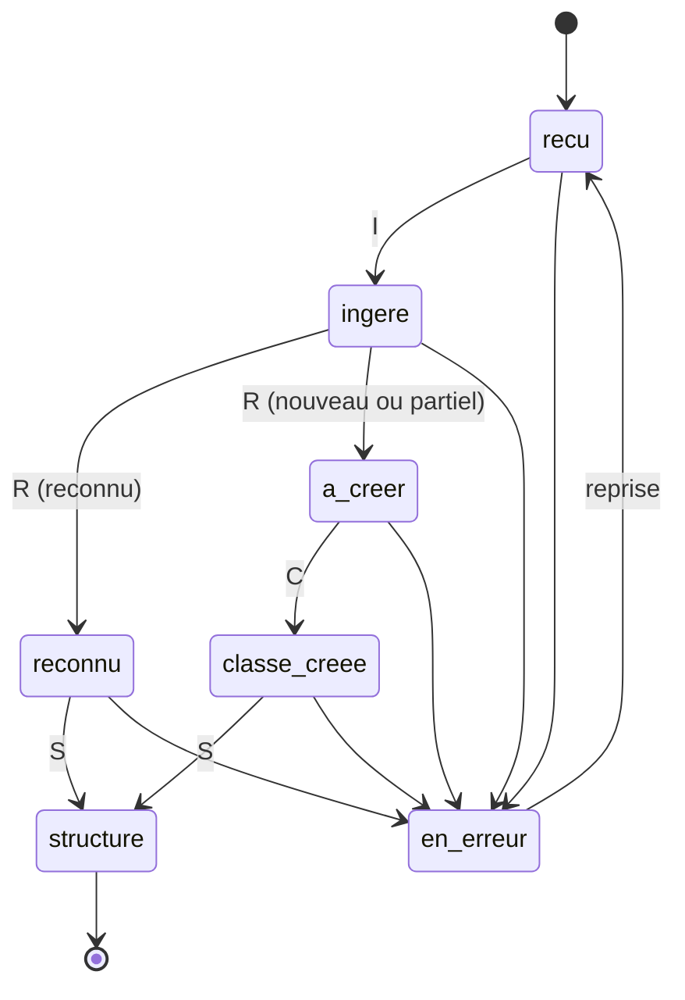

# Conception v2 : classification documentaire, agents spécialisés, sessions

Statut : proposition du 2026-09-26, mise à jour le même jour (glossaire commun structuré en taxonomie de domaines, passerelle LLM, traçabilité, formats de documents, ontologies structurelles et sémantiques, métadonnées, pipeline documentaire). Les seuils et choix d'algorithmes sont des hypothèses à mesurer (voir IAF-E7 US7.7). Remplace la vue d'ensemble de [architecture.md](../architecture.md).

## 1. Vocabulaire

| Terme | Sens dans IAFActory |
|---|---|
| Glossaire métier | Glossaire **commun** à tous les projets : les termes du métier (SKOS). Il est structuré en taxonomie de domaines. |
| Taxonomie de domaines | Arbre (relations plus large / plus étroit, SKOS `broader`/`narrower`) des domaines métier. Chaque terme du glossaire est rattaché à un domaine. |
| Domaine | Nœud de la taxonomie (ex. « Contrats », « Contrats > Clauses de résiliation »). Porte des termes et des éléments d'ontologie. |
| Ontologie sémantique | Décrit le **contenu** : types d'entités, types de relations, attributs. Rattachée aux domaines de la taxonomie. |
| Ontologie structurelle | Décrit l'**organisation** du contenu : types d'éléments (section, diapositive, tableau, figure, liste, légende, note) et leur agencement (imbrication, ordre, rôle). Vocabulaire de base commun ; un profil par classe documentaire. |
| Squelette | Arbre d'éléments typés extrait d'un document (type, niveau, ordre, libellé, nom de mise en page). Sert à reconnaître sa forme. |
| Métadonnées | Propriétés que le document porte lui-même, quand il en a (titre, auteur, sujet, mots-clés, dates, révision, application productrice, gabarit). |
| Pipeline documentaire | Chaîne applicative Ingestion, Reconnaissance, (Création de classe), Structuration. Sans rapport avec les pipelines GitHub CI/CD. |
| Classe documentaire | Type de document (ex. contrat, fiche technique). Réunit un **profil structurel** (son ontologie structurelle) et un ou plusieurs domaines, dont les ontologies sémantiques forment son contenu attendu. À ne pas confondre avec une classe OWL. |
| Terme candidat | Terme induit d'un document non reconnu. Reste propre au projet, hors du glossaire commun, tant qu'il n'est pas promu. |
| Passerelle LLM | Service unique par lequel tout appel à un modèle passe ; il décide qui peut utiliser quel modèle et mesure l'usage. |
| Alias d'usage | Nom stable d'un usage (extraction, agent, cadrage, jugement, embedding) que la passerelle associe à un modèle concret. |
| Journal d'activité | Historique en ajout seul des accès et actions (qui, quoi, quand, résultat). |
| Schéma du document | Types d'entités et de relations extraits d'un document sans a priori. |
| Reconnu | Le schéma du document est suffisamment couvert par une ou plusieurs classes documentaires connues. |
| Spécialité | Ensemble de classes documentaires (et, par elles, de domaines) qu'un agent maîtrise. |
| Session | Conversation d'un utilisateur (viewer ou creator) avec un agent. |
| Connecteur | Accès configuré à une source externe de documents. |

## 2. Vue d'ensemble

Tout appel à un modèle passe par la passerelle (section 10). Toute action et tout accès alimentent le journal d'activité (section 11).

### Documents acceptés

PDF, PowerPoint (`.pptx`) et Word (`.docx`). Documents techniques clairs, produits numériquement : aucun manuscrit, donc aucun OCR. Conséquences :

- Un PDF sans couche de texte (scan) est détecté et refusé avec un message explicite, au lieu d'être passé à un OCR.
- Les formats anciens (`.doc`, `.ppt`) sont refusés : conversion préalable demandée.
- Le découpage suit la structure (titres, diapositives, tableaux), pas une taille fixe seule.
- Outil candidat d'analyse : Docling (open source ; PDF, DOCX et PPTX avec mise en page, tableaux et titres ; OCR optionnel et désactivable, selon sa documentation). Licence, empreinte mémoire et qualité sur vos documents à vérifier avant adoption (US3.8).
- L'analyse d'un fichier tourne dans un conteneur isolé (les documents sont des entrées non fiables).

## 3. Modèle de données

Postgres (transactionnel) : utilisateurs, rôles, projets, exclusions viewer, agents et versions, spécialités d'agent, sessions et messages, connecteurs et secrets chiffrés, journal d'audit.

Neo4j (graphe de connaissances) :

- `(:Document)-[:HAS_CHUNK]->(:Chunk)` avec provenance (page, position) et embedding.
- `(:Document)-[:IN_CLASS {score, coverage, method, version}]->(:DocumentClass)` : plusieurs classes possibles par document.
- `(:DocumentClass {status})` avec `status` parmi `provisoire`, `validee`, `rejetee`.
- `(:DocumentClass)-[:USES_DOMAIN]->(:Domain)` : une classe utilise un ou plusieurs domaines ; `(:Domain)-[:NARROWER]->(:Domain)` forme la taxonomie ; `(:Term)-[:IN_DOMAIN]->(:Domain)` ; `(:Domain)-[:HAS_ONTOLOGY]->(:Ontology)`. La taxonomie et le glossaire sont communs à tous les projets ; classes, documents et termes candidats sont propres au projet.
- `(:Chunk)-[:MENTIONS]->(:Entity)`, `(:Entity)-[:REL {type}]->(:Entity)`, `(:Entity)-[:INSTANCE_OF]->(:OntologyElement)`.
- Structure : `(:Document)-[:HAS_ELEMENT]->(:StructElement {kind, level, position, label, layout})`, `(:StructElement)-[:CHILD]->(:StructElement)`, `(:StructElement)-[:HAS_CHUNK]->(:Chunk)`. Un fait sémantique se situe donc dans le document (quelle section, quelle diapositive).
- Ontologies de la classe : `(:DocumentClass)-[:HAS_STRUCTURAL_ONTOLOGY]->(:Ontology {kind: 'structural'})` et `(:Domain)-[:HAS_ONTOLOGY]->(:Ontology {kind: 'semantic'})`. `(:DocumentClass)-[:HAS_STRUCTURE_PROFILE]->(:StructuralProfile)` porte le squelette type.
- Métadonnées : propriétés normalisées sur `(:Document)` (titre, auteur, sujet, mots-clés, dates, révision, application, gabarit, langue) plus la valeur brute et sa source.

Fuseki (RDF, source de vérité des ontologies, décision à confirmer dans l'ADR 0002) : un graphe nommé par glossaire, par version d'ontologie structurelle ou sémantique, et par schéma induit d'une classe provisoire. Ontologie structurelle de base : [ontologies/structure/iaf-structure-base.ttl](../../ontologies/structure/iaf-structure-base.ttl). Import vers Neo4j par n10s.

### 3.1 Ontologies structurelles et sémantiques

| | Structurelle | Sémantique |
|---|---|---|
| Décrit | l'organisation : types d'éléments et agencement | le contenu : types d'entités, de relations, attributs |
| Exemple | fiche technique : Titre, Résumé, Tableau de caractéristiques, Section Normes | Matériau, Norme, Fournisseur ; « conforme à » ; résistance (MPa) |
| Rattachée à | la classe documentaire (profil structurel) | les domaines de la taxonomie, via la classe |
| Sert à | reconnaître la forme d'un document, découper, situer les faits | reconnaître le sujet, guider l'extraction d'entités et de relations |
| Reconnaissance | peu coûteuse, déterministe, sans LLM | coûteuse, appuyée sur un LLM |

Les deux axes sont indépendants : un même contenu en Word et en PowerPoint a la même sémantique mais une structure différente. Le vocabulaire structurel de base (Document, Section, Slide, Paragraph, Table, Figure, List, ListItem, Caption, Note, CodeBlock, Formula, avec `hasPart`, `precedes`, `headingLevel`, `layoutName`...) est commun ; l'ontologie structurelle d'une classe le spécialise (rôles de sections, imbrications attendues, éléments obligatoires). Le fichier de base est écrit, non chargé dans Fuseki ni validé par un parseur RDF (Docker arrêté ; validation prévue en CI, ci-infra).

### 3.2 Métadonnées des documents

Conservées quand le document en porte, jamais inventées quand il n'en a pas (champ absent, pas de valeur par défaut). Champs normalisés : titre, auteur, dernier modificateur, sujet, mots-clés, dates de création et de modification, révision, application productrice, nom du gabarit, langue ; pour PowerPoint, noms des mises en page utilisées. La valeur brute et sa source (propriétés du document selon le format) sont gardées à côté de la valeur normalisée. Le nom exact des champs par format et leur accessibilité via l'outil d'analyse retenu sont à vérifier (US3.13).

- **Signal faible** : les métadonnées aident la reconnaissance (gabarit, mises en page, titre type) mais ne décident jamais seules : elles sont modifiables par n'importe qui, donc non fiables.
- **Données personnelles** : auteur et dernier modificateur sont des noms de personnes. Ils suivent les mêmes règles d'accès que le document (exclusions viewer comprises), sont soumis à la rétention (E12) et ne sont pas envoyés à un LLM par défaut.
- **Contenu non fiable** : traité comme une donnée, jamais comme une instruction.

## 4. Reconnaissance : un document est-il reconnu ?

Principe : extraire d'abord sans a priori, puis comparer au connu, sur **deux axes indépendants** : la forme (structure) et le contenu (sémantique). Les documents n'ont pas besoin d'être étiquetés par le creator. Cette section est l'étape R du pipeline documentaire (section 13).

1. **Squelette et métadonnées** (produits par l'ingestion) : arbre `Ss` d'éléments typés du document et métadonnées éventuelles.
2. **Reconnaissance structurelle** (peu coûteuse, sans LLM) : `Ss` est comparé aux profils structurels des classes. Mesures candidates : similarité de Jaccard, accélérée par MinHash, sur les libellés de titres de section normalisés ; cosinus des histogrammes de types d'éléments ; forme de l'imbrication. Les métadonnées (gabarit, noms de mises en page PowerPoint) servent de signal faible. Sortie : un score structurel par classe candidate.
3. **Extraction ouverte sémantique** : triplets libres, types d'entités et relations propres au document. Approche de référence : EDC (Extract, Define, Canonicalize), qui fonctionne avec ou sans schéma cible et récupère les éléments de schéma pertinents pour limiter la taille du prompt ([arXiv 2404.03868](https://arxiv.org/abs/2404.03868)). Sortie : schéma du document `Sd`, chaque élément `e` pondéré par sa fréquence normalisée `w_e`.
4. **Pré-filtrage sémantique** des classes candidates (top-k) : comparaison bon marché de `Sd` avec chaque classe. La taxonomie sert ici : les termes de `Sd` sont projetés sur les domaines (via les termes du glossaire), ce qui donne un profil de domaines du document ; un terme apparié à un domaine étroit crédite aussi ses domaines plus larges, avec un poids décroissant par niveau. Le profil est comparé aux domaines de chaque classe.
5. **Mapping fin** de `Sd` vers les ontologies sémantiques de chaque classe candidate : correspondances élément par élément.
6. **Décision croisée** structure x sémantique, y compris multi-classes (section 4.2).
7. **Non reconnu ou partiellement reconnu** : création de classe ou de variante (section 4.3).

### 4.1 Algorithmes de comparaison

Cascade du moins cher au plus précis, chaque étage ne traitant que les survivants du précédent.

| Étage | Algorithme | Rôle | Point faible | Statut de la référence |
|---|---|---|---|---|
| 1 | Jaccard pondéré sur ensembles de termes, accéléré par MinHash + LSH | Pré-filtre en temps quasi constant par paire, sans comparer toutes les paires | Forme de surface seulement, aucune sémantique | Vérifié : documentation datasketch (MinHash, MinHash LSH, LSH Forest pour le top-k) |
| 1 | Similarité cosinus d'embeddings (centroïde de classe vs document) via index vectoriel Neo4j | Pré-filtre sémantique, top-k | Centroïde flou pour une classe hétérogène | Index vectoriel natif Neo4j 5 (ADR 0001) |
| 2 | Appariement d'éléments : lexical (labels, synonymes du glossaire) + embeddings de labels | Correspondances candidates `(e, o)` avec score | Sens du contexte | Approche des systèmes LogMap, AML (lexical puis extension structurelle puis réparation logique) |
| 2 | Appariement neuronal de type BERTMap | Meilleure sémantique que le lexical seul ; annoncé supérieur à LogMap et AML sur des tâches OAEI dans son article | Demande un entraînement ou un fine-tuning | Vérifié : article AAAI |
| 3 | Propagation structurelle (voisins compatibles se renforcent) | Corrige les correspondances ambiguës par la structure du graphe | Coût, sensibilité au bruit | À vérifier (Similarity Flooding, Weisfeiler-Lehman) : non consulté dans cette session |
| 4 | Arbitrage LLM sur la zone grise seulement | Trancher les paires ambiguës | Coût et latence, non déterminisme | LLMs4OM référence cette approche |
| S | Jaccard pondéré / MinHash sur les libellés de titres normalisés ; cosinus d'histogrammes de types d'éléments | Reconnaissance structurelle bon marché, sans LLM | Sensible aux titres renommés ou traduits | MinHash vérifié (datasketch) |
| S | Distance d'édition d'arbres entre squelettes | Forme exacte de l'imbrication | Coût quadratique, bruit d'extraction | À vérifier : non consulté dans cette session |

Recommandation initiale : étages 1 puis 2 (embeddings + lexical), étage 4 en zone grise, étage 3 seulement si le banc d'évaluation le justifie. Le choix final vient de US7.7, pas de cette table.

### 4.2 Décision de reconnaissance

Pour un document `d` et une classe `C` d'ontologie `O_C` :

- `couverture(d, C) = somme des w_e des éléments de Sd appariés à O_C / somme des w_e`.
- `typicité(d, C) = fraction des éléments centraux de O_C retrouvés dans Sd` (évite qu'une classe très générale « reconnaisse » tout).
- Sélection gloutonne : retenir la classe de meilleure couverture, retirer les éléments couverts, recalculer la couverture résiduelle, continuer tant que le gain dépasse `delta`.
- Reconnu si la couverture cumulée dépasse `tau_union` ; chaque classe retenue exige couverture et typicité minimales.
- Chaque affectation garde son explication : éléments appariés, score, algorithme, version des seuils.
- `tau_*`, `delta` et le seuil d'appariement sont calibrés sur un jeu annoté hors échantillon, jamais sur les documents ayant servi à les régler.

**Axe structurel** : `structure(d, C)` est le meilleur score de `Ss` contre le profil structurel de `C` (et ses variantes). Reconnu structurellement si `structure(d, C) >= tau_struct`, seuil calibré comme les autres.

**Décision croisée** (confirmée par l'utilisateur le 2026-09-27 ; les seuils restent à mesurer, IAF-47) :

| Sémantique | Structure | Issue |
|---|---|---|
| reconnue | reconnue | Document rattaché à la classe ; structuration directe. |
| reconnue | nouvelle | **Variante structurelle** : le document rejoint la classe sémantique ; un profil structurel variante (provisoire) est créé. |
| nouvelle | reconnue | Contenu nouveau dans une forme connue : ontologie sémantique induite (provisoire), rattachée à une classe existante ou à une nouvelle classe selon la revue. |
| nouvelle | nouvelle | Classe entièrement nouvelle : ontologies structurelle et sémantique induites. |

### 4.3 Document non reconnu ou partiellement reconnu (étape C)

1. **Ontologie sémantique induite** : le schéma `Sd` est normalisé (canonicalisation, fusion des synonymes) puis publié comme ontologie induite dans un graphe nommé Fuseki propre au projet.
2. **Ontologie structurelle induite** : le squelette `Ss` est généralisé en profil structurel (types d'éléments, imbrication, ordre, rôles de sections). Un seul document donne un profil très spécifique : il s'affine quand des documents voisins le rejoignent.
3. Une classe documentaire `provisoire` est créée (ou une variante, ou une ontologie ajoutée, selon la décision croisée). Les termes non reconnus deviennent des **termes candidats** propres au projet : le glossaire commun n'est jamais modifié automatiquement. La classe est rattachée aux domaines existants les plus proches, s'il y en a ; sinon elle n'a pas de domaine jusqu'à la revue. La promotion d'un terme candidat vers le glossaire commun est une action gouvernée (US3.10).
4. Anti-prolifération : avant création, comparaison de `Sd` et `Ss` aux classes provisoires existantes (même cascade) ; si proche, le document rejoint la classe existante.
5. Le creator revoit les classes provisoires : valider, renommer, fusionner, rejeter (US7.6).
6. Un document rejeté ou fusionné est reclassé automatiquement, puis restructuré (étape S).

## 5. Agents spécialisés

Un agent déclare une **spécialité** : classes documentaires (ou domaines de la taxonomie, qui se ramènent aux classes qui les utilisent). À l'exécution, la recherche est filtrée par :

`classes du document ∩ spécialité de l'agent`, puis par les exclusions du viewer en session, puis par le projet.

Un document multi-classes est utilisable par un agent dès qu'une de ses classes est dans la spécialité ; seules les parties du graphe rattachées à cette classe sont utilisées (les entités portent leur classe d'origine). Un agent sans spécialité n'existe pas : c'est une validation de création.

## 6. Besoin du creator : cadrage guidé

Le creator décrit un besoin ; un assistant de cadrage produit un brouillon d'agent (US8.x) :

1. Reformuler le besoin et le faire valider.
2. Poser les questions manquantes (qui utilise, quelles décisions, quelles sources).
3. Proposer : spécialité (classes existantes ou à créer), sources et accès (connecteurs), tests de validation, approche.
4. Signaler les écarts : classe absente, source non accessible, glossaire manquant.

Le creator garde la main : rien n'est créé sans sa validation.

## 7. Connecteurs sécurisés

Menaces retenues : fuite d'identifiants, SSRF et pivot réseau, exfiltration via le LLM, sur-privilège, contenu hostile dans les documents (injection de prompt). Contrôles :

- Identifiants chiffrés (enveloppe), jamais renvoyés à l'interface ni insérés dans un prompt ; rotation et révocation.
- Portées minimales, lecture seule par défaut.
- Exécution isolée avec sortie réseau limitée à une liste blanche par connecteur ; blocage des adresses internes (SSRF).
- Contenu importé traité comme donnée non fiable : jamais exécuté comme instruction.
- Journal d'audit de chaque lecture et de chaque changement de configuration.
- Réseau : magasins de données non exposés hors du réseau interne (voir `compose.secure.yaml`).

Détail : [ADR 0003](../adr/0003-connecteurs-securises.md).

## 8. Sessions

Viewer et creator ouvrent des sessions avec un agent visible pour eux. Un viewer n'a aucun droit d'écriture sur l'agent ni sur le projet ; ses exclusions filtrent la récupération à chaque tour, pas seulement à l'ouverture de la session. Historique conservé par utilisateur ; règle de visibilité pour le creator à trancher (question ouverte, IAF-E10).

## 9. Matrice des droits (arrêtée, US5.6)

Décidée en atelier le 2026-09-27. Remplace la version en hypothèses. Quatre choix structurants, tranchés par l'utilisateur :

1. **Comptes** : l'admin crée tous les comptes, creator et viewer (US5.7 ajoutée : jusque-là seule la création de creator était couverte).
2. **Glossaire commun** : gouverné par **revue collective des creators**, pas par un rôle de curateur ni par l'admin seul (US3.10 révisée).
3. **Connecteurs** : **toute activation est soumise à l'admin**, même pour un type déjà au catalogue (US9.1 révisée) — posture plus stricte que le reste de la matrice, justifiée par le risque (ADR 0003).
4. **Budget LLM** : **l'admin fixe le budget de chaque agent individuellement** ; le creator choisit le fournisseur et le modèle (US4.1) mais jamais le budget (US11.3 révisée).

| Domaine | Action | viewer | creator (propriétaire) | admin |
|---|---|---|---|---|
| Comptes | Créer un compte creator | non | non | oui |
| Comptes | Créer un compte viewer | non | non | oui |
| Comptes | Se connecter, voir son propre profil | oui | oui | oui |
| Projets | Créer, renommer, décrire un projet | non | oui | oui |
| Projets | Voir un projet | oui, sauf exclusions | oui, les siens | oui, tous |
| Projets | Arrêter ou effacer un projet | non | non | oui, tous |
| Glossaire commun | Consulter la taxonomie et les termes | oui | oui | oui |
| Glossaire commun | Proposer un terme candidat ou un domaine | non | oui | oui |
| Glossaire commun | Approuver une promotion (revue par pairs) | non | oui, si non proposant | non (recours seulement) |
| Glossaire commun | Annuler une promotion erronée (recours) | non | non | oui |
| Ontologies sémantiques (par domaine) | Proposer une modification | non | oui | oui |
| Ontologies sémantiques (par domaine) | Approuver (même mécanisme que le glossaire) | non | oui, si non proposant | non (recours) |
| Ontologies structurelles (profil de classe, propre au projet) | Créer, modifier | non | oui | oui |
| Ontologie structurelle de base (vocabulaire commun) | Modifier | non | non | oui |
| Classes documentaires | Créer, fusionner, valider, rejeter une classe provisoire | non | oui, les siennes | oui, toutes |
| Agents | Créer, modifier, versionner, définir la spécialité | non | oui | oui |
| Agents | Choisir le fournisseur et le modèle (catalogue passerelle) | non | oui | oui |
| Agents | Fixer ou modifier le budget LLM d'un agent | non | non | oui |
| Agents | Lancer, suivre, arrêter un agent (US4.2) | non | oui, les siens | oui, tous |
| Agents | Définir les tests de validation, voir le verdict | non | oui, les siens | oui, tous |
| Groupes d'agents | Créer, gérer un groupe | non | oui | oui |
| Sessions | Ouvrir une session avec un agent visible | oui, si non exclu | oui | oui |
| Sessions | Consulter, reprendre, supprimer ses sessions | les siennes | les siennes | toutes |
| Exclusions viewer | Poser ou lever une exclusion sur son propre projet | non | oui | non |
| Exclusions viewer | Poser une exclusion sur le projet d'un autre creator | non | non (403) | non |
| Connecteurs | Déclarer un connecteur (brouillon) | non | oui | oui |
| Connecteurs | Approuver l'activation d'un connecteur (tout type, même déjà catalogué) | non | non | oui |
| Connecteurs | Fournir ou faire tourner un identifiant (écriture seule) | non | oui, le sien, une fois approuvé | oui |
| Connecteurs | Révoquer un connecteur | non | oui, le sien | oui, tous |
| Passerelle LLM | Configurer les alias d'usage système | non | non | oui |
| Journal d'activité | Consulter son propre historique | oui | oui | oui |
| Journal d'activité | Consulter l'historique de ses projets | non | oui | oui, tout |
| Journal d'activité | Exporter en CSV | non | non | oui |
| Rétention et purge des journaux | Configurer | non | non | oui |

Cas limites explicitement tranchés :

- Un creator peut approuver la promotion d'un terme qu'il n'a **pas** proposé lui-même ; il ne peut pas auto-approuver sa propre proposition (évite qu'un seul creator peuple le glossaire commun seul).
- L'admin n'a pas de droit de vote dans la revue par pairs ; il garde seulement un droit de recours pour annuler une promotion déjà faite si elle s'avère erronée (US3.10).
- Le budget d'un agent n'est jamais un champ modifiable par le creator, même en lecture-écriture partielle : c'est un champ affiché en lecture seule côté creator (US11.3, US4.1).
- L'approbation d'un connecteur par l'admin est requise même quand le type de connecteur est déjà utilisé ailleurs dans le projet ou par un autre creator : chaque instance est jugée séparément (US9.1).

Questions encore ouvertes, non bloquantes pour coder la matrice ci-dessus : un utilisateur peut-il porter plusieurs rôles ; le creator voit-il les sessions de ses viewers (question 3, section 12) ; seuil exact de la revue par pairs (une seule approbation d'un autre creator suffit par défaut, à ajuster si le nombre de creators grandit).

## 10. Passerelle LLM

Tout appel à un modèle traverse une passerelle unique, pour décider **qui utilise quel LLM** et mesurer l'usage. Décision et alternatives : [ADR 0004](../adr/0004-passerelle-llm.md).

- **Produit** : LiteLLM proxy (image officielle `docker.litellm.ai/berriai/litellm`, version épinglée), packagé dans notre image `infra/llm-gateway`.
- **Fournisseurs, hybride (décision 2026-09-27)** : Anthropic (API), Gemini (API Google AI Studio, préfixe `gemini/`, clé simple `GEMINI_API_KEY`) et Ollama (local, préfixe `ollama_chat/`, profil compose `llm`). Un même catalogue de modèles derrière la passerelle, quel que soit le fournisseur.
- **Choix par agent** : chaque agent choisit son modèle (donc son fournisseur) dans ce catalogue au moment de sa définition (US4.1) ; un agent qui ne choisit rien reçoit l'alias d'usage par défaut de son rôle (`iaf-agent`). Un agent sensible peut ainsi rester sur Ollama (aucune donnée envoyée à un tiers) tandis qu'un autre utilise Gemini ou Claude pour sa capacité.
- **Orchestration** : `jev-router` (MIT, expérimental, un seul commit au 2026-09-16) ajouté comme hook de la passerelle. Récupéré à un commit épinglé par le Dockerfile, comme Fuseki. Sans clé TypeSafe, il choisit le modèle éligible le moins cher, en local, parmi les candidats des trois fournisseurs. Avec `TYPESAFE_API_KEY`, un résumé de la requête (jusqu'à 8 messages de 2000 caractères) part chez un tiers (TypeSafe) : **désactivé par défaut**, à n'activer que pour des charges sans document confidentiel. `iaf-auto` (routage automatique) reste une option parmi d'autres : le choix explicite du modèle par agent est le chemin par défaut.
- **Alias d'usage système** : les services internes demandent un alias (`iaf-extraction`, `iaf-agent`, `iaf-cadrage`, `iaf-judge`, `iaf-auto`) ; l'admin remappe un alias vers un autre modèle sans toucher au code.
- **Qui utilise quoi** : une clé virtuelle par consommateur (service interne, agent, groupe de sessions) avec modèles autorisés, budget, limites de débit ; gérées par l'API IAFActory, seule détentrice de la clé maître.
- **Données** : base Postgres dédiée (`litellm`), rôle dédié. Les clés fournisseurs ne sortent jamais de la passerelle.
- **Réseau** : la passerelle est le seul service (avec les connecteurs, à part) ayant une sortie Internet vers les fournisseurs (Anthropic, Google) ; liste blanche d'hôtes fournisseurs à imposer. Ollama reste interne (pas de sortie Internet pour cette voie).

## 11. Traçabilité et tableaux de bord d'usage

Deux sources, un seul endroit de lecture (Postgres) :

1. **Journal d'activité IAFActory** : table `activity_events` en ajout seul : horodatage, acteur, rôle, action (connexion, ouverture de session, consultation de document, lancement d'agent, exclusion posée, création de creator, arrêt de projet...), type et identifiant de ressource, projet, résultat (autorisé, refusé, erreur), identifiant de requête. Pas de contenu de documents ni de messages ; pas de secrets. Un refus d'accès est un événement comme un autre (il révèle les tentatives).
2. **Usage LLM** : journaux de dépense de la passerelle (par clé, équipe, utilisateur, modèle : jetons, coût, latence). Le réglage qui empêche de stocker le contenu des prompts dans ces journaux est à vérifier avant tout usage réel.

Consultation, volontairement simple pour l'instant :

- Un **historique d'activité** filtrable (période, acteur, action, projet), limité par rôle : chacun voit ses propres événements, le creator ceux de ses projets, l'admin tout.
- Un **tableau de bord** de comptages : activité par jour, par agent, par utilisateur, refus et erreurs, jetons et coût par consommateur et par modèle.
- Les tableaux de bord reposent sur des **vues SQL stables** : le passage à Grafana plus tard consiste à le brancher en lecture seule sur Postgres, sans changer le modèle.
- Rétention configurable ; purge planifiée.

## 12. Questions ouvertes

1. Quelles sources externes faut-il brancher en premier (SharePoint, Confluence, dépôts, bases) ? Détermine US9.5.
2. Volumétrie : nombre de documents, de classes, de domaines, d'agents, d'utilisateurs simultanés.
3. Le creator voit-il les sessions des viewers ?
4. Langues des documents.
5. Gouvernance du glossaire commun : qui modifie la taxonomie, qui promeut un terme candidat ? (à traiter avec les capacités des creators, US5.6).
6. Rétention du journal d'activité, et durée de conservation des sessions.
7. Ontologies structurelles : le vocabulaire de base est commun ; les profils structurels sont-ils propres à chaque classe (hypothèse) ou partageables entre classes et projets ?
8. Métadonnées : lesquelles le creator souhaite-t-il exploiter, et l'auteur peut-il apparaître dans les réponses des agents ?
9. Orchestration du pipeline documentaire : file dans Postgres (proposition) ou moteur de workflow (ADR 0006).
10. Modèle et prix de référence par fournisseur (Anthropic, Gemini, Ollama) à charger dans `router.yaml` pour que `iaf-auto` choisisse sur des coûts réels, pas sur l'ordre de la liste.
11. Un agent peut-il changer de fournisseur après coup sans perdre son historique de session ?

Tranché le 2026-09-26 : glossaire commun structuré en taxonomie de domaines ; une classe documentaire utilise un ou plusieurs domaines ; documents PDF, PowerPoint et Word, sans manuscrit ; ontologies structurelles et sémantiques distinguées ; métadonnées conservées quand elles existent ; pipeline documentaire Ingestion, Reconnaissance, Structuration, Création de classe.

Tranché le 2026-09-27 : fournisseurs LLM hybrides (Anthropic, Gemini, Ollama) derrière la passerelle, choix du modèle décidé par agent ; la matrice de décision croisée structure x sémantique (section 4.2) et le principe qu'une variante structurelle reste dans la même classe sémantique sont confirmés.

## 13. Pipeline documentaire

Chaîne applicative qui traite chaque document. Sans rapport avec les pipelines GitHub CI/CD (écrits, inactifs). Décision d'orchestration : [ADR 0006](../adr/0006-orchestration-pipeline-documentaire.md).

| Étape | Entrée | Sortie | Détail |
|---|---|---|---|
| **I** Ingestion | Fichier PDF, PowerPoint ou Word | Document, métadonnées, squelette `Ss`, chunks par structure, embeddings (alias `iaf-embedding` de la passerelle) | US3.1, US3.8, US3.13 |
| **R** Reconnaissance | `Ss`, métadonnées, chunks | `Sd`, scores structurels et sémantiques, issue de la décision croisée | IAF-E7 (section 4) |
| **C** Création de classe | Issue non ou partiellement reconnue | Classe ou variante provisoire, ontologies induites | US7.5 (section 4.3) |
| **S** Structuration | Classes du document et leurs ontologies | Éléments structurels et faits sémantiques (entités, relations, attributs) dans Neo4j, avec provenance | US13.4 |

Enchaînement : **I, puis R, puis (C si l'issue n'est pas « reconnu »), puis S.** Tu as listé la création de classe en dernier ; elle précède pourtant la structuration pour un document dont la classe n'existe pas encore, car S a besoin des ontologies que C produit. Un document reconnu saute C.

Propriétés exigées :

- **État par document et par étape** (`pipeline_runs`, `stage_runs` en Postgres : document, étape, statut, empreinte des entrées, version de configuration, durées, erreur, métriques).
- **Idempotence** : rejouer une étape avec les mêmes entrées et la même configuration ne crée aucun doublon.
- **Reprise** : un document en erreur reprend à l'étape échouée.
- **Retraitement en cascade** : modifier une classe, une ontologie ou un seuil refait R et S (jamais I) pour les documents concernés.
- **Appels LLM** uniquement par la passerelle, avec un alias par étape et un budget.
- **Isolation** : l'analyse de fichier (I) s'exécute dans un conteneur sans réseau.
- **Observabilité** : chaque transition est un événement d'activité (E12) ; durée, taux d'échec et coût par étape apparaissent au tableau de bord.
- **Lots** : traitement de nombreux documents avec concurrence bornée par étape.
