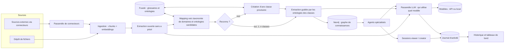

# Conception v2 : classification documentaire, agents spécialisés, sessions

Statut : proposition du 2026-09-26, mise à jour le même jour (glossaire commun structuré en taxonomie de domaines, passerelle LLM, traçabilité, formats de documents). Les seuils et choix d'algorithmes sont des hypothèses à mesurer (voir IAF-E7 US7.7). Remplace la vue d'ensemble de [architecture.md](../architecture.md).

## 1. Vocabulaire

| Terme | Sens dans IAFActory |
|---|---|
| Glossaire métier | Glossaire **commun** à tous les projets : les termes du métier (SKOS). Il est structuré en taxonomie de domaines. |
| Taxonomie de domaines | Arbre (relations plus large / plus étroit, SKOS `broader`/`narrower`) des domaines métier. Chaque terme du glossaire est rattaché à un domaine. |
| Domaine | Nœud de la taxonomie (ex. « Contrats », « Contrats > Clauses de résiliation »). Porte des termes et des éléments d'ontologie. |
| Ontologie | Classes OWL et propriétés, rattachées aux domaines du glossaire. |
| Classe documentaire | Type de document (ex. contrat, fiche technique). Utilise un ou plusieurs domaines ; son ontologie est l'union de celles de ses domaines. À ne pas confondre avec une classe OWL. |
| Terme candidat | Terme induit d'un document non reconnu. Reste propre au projet, hors du glossaire commun, tant qu'il n'est pas promu. |
| Passerelle LLM | Service unique par lequel tout appel à un modèle passe ; il décide qui peut utiliser quel modèle et mesure l'usage. |
| Alias d'usage | Nom stable d'un usage (extraction, agent, cadrage, jugement, embedding) que la passerelle associe à un modèle concret. |
| Journal d'activité | Historique en ajout seul des accès et actions (qui, quoi, quand, résultat). |
| Schéma du document | Types d'entités et de relations extraits d'un document sans a priori. |
| Reconnu | Le schéma du document est suffisamment couvert par une ou plusieurs classes documentaires connues. |
| Spécialité | Ensemble de classes documentaires (et, par elles, de domaines) qu'un agent maîtrise. |
| Session | Conversation d'un utilisateur (viewer ou creator) avec un agent. |
| Connecteur | Accès configuré à une source externe de documents. |

## 2. Vue d'ensemble

Tout appel à un modèle passe par la passerelle (section 10). Toute action et tout accès alimentent le journal d'activité (section 11).

### Documents acceptés

PDF, PowerPoint (`.pptx`) et Word (`.docx`). Documents techniques clairs, produits numériquement : aucun manuscrit, donc aucun OCR. Conséquences :

- Un PDF sans couche de texte (scan) est détecté et refusé avec un message explicite, au lieu d'être passé à un OCR.
- Les formats anciens (`.doc`, `.ppt`) sont refusés : conversion préalable demandée.
- Le découpage suit la structure (titres, diapositives, tableaux), pas une taille fixe seule.
- Outil candidat d'analyse : Docling (open source ; PDF, DOCX et PPTX avec mise en page, tableaux et titres ; OCR optionnel et désactivable, selon sa documentation). Licence, empreinte mémoire et qualité sur vos documents à vérifier avant adoption (US3.8).
- L'analyse d'un fichier tourne dans un conteneur isolé (les documents sont des entrées non fiables).

## 3. Modèle de données

Postgres (transactionnel) : utilisateurs, rôles, projets, exclusions viewer, agents et versions, spécialités d'agent, sessions et messages, connecteurs et secrets chiffrés, journal d'audit.

Neo4j (graphe de connaissances) :

- `(:Document)-[:HAS_CHUNK]->(:Chunk)` avec provenance (page, position) et embedding.
- `(:Document)-[:IN_CLASS {score, coverage, method, version}]->(:DocumentClass)` : plusieurs classes possibles par document.
- `(:DocumentClass {status})` avec `status` parmi `provisoire`, `validee`, `rejetee`.
- `(:DocumentClass)-[:USES_DOMAIN]->(:Domain)` : une classe utilise un ou plusieurs domaines ; `(:Domain)-[:NARROWER]->(:Domain)` forme la taxonomie ; `(:Term)-[:IN_DOMAIN]->(:Domain)` ; `(:Domain)-[:HAS_ONTOLOGY]->(:Ontology)`. La taxonomie et le glossaire sont communs à tous les projets ; classes, documents et termes candidats sont propres au projet.
- `(:Chunk)-[:MENTIONS]->(:Entity)`, `(:Entity)-[:REL {type}]->(:Entity)`, `(:Entity)-[:INSTANCE_OF]->(:OntologyElement)`.

Fuseki (RDF, source de vérité des ontologies, décision à confirmer dans l'ADR 0002) : un graphe nommé par glossaire, par version d'ontologie et par schéma induit d'un document ou d'une classe provisoire. Import vers Neo4j par n10s.

## 4. Classification : un document est-il reconnu ?

Principe : extraire d'abord sans a priori, puis comparer au connu. Les documents n'ont pas besoin d'être étiquetés par le creator.

1. **Extraction ouverte** : triplets libres, types d'entités et relations propres au document. Approche de référence : EDC (Extract, Define, Canonicalize), qui fonctionne avec ou sans schéma cible et récupère les éléments de schéma pertinents pour limiter la taille du prompt ([arXiv 2404.03868](https://arxiv.org/abs/2404.03868)). Sortie : schéma du document `Sd`, chaque élément `e` pondéré par sa fréquence normalisée `w_e`.
2. **Pré-filtrage** des classes candidates (top-k) : comparaison bon marché de `Sd` avec chaque classe. La taxonomie sert ici : les termes de `Sd` sont projetés sur les domaines (via les termes du glossaire), ce qui donne un profil de domaines du document ; un terme apparié à un domaine étroit crédite aussi ses domaines plus larges, avec un poids décroissant par niveau. Le profil est comparé aux domaines de chaque classe.
3. **Mapping fin** de `Sd` vers l'ontologie de chaque classe candidate : correspondances élément par élément.
4. **Décision** multi-classes par couverture (section 4.2).
5. **Non reconnu** : la classe est créée à partir de `Sd` (section 4.3).

### 4.1 Algorithmes de comparaison

Cascade du moins cher au plus précis, chaque étage ne traitant que les survivants du précédent.

| Étage | Algorithme | Rôle | Point faible | Statut de la référence |
|---|---|---|---|---|
| 1 | Jaccard pondéré sur ensembles de termes, accéléré par MinHash + LSH | Pré-filtre en temps quasi constant par paire, sans comparer toutes les paires | Forme de surface seulement, aucune sémantique | Vérifié : documentation datasketch (MinHash, MinHash LSH, LSH Forest pour le top-k) |
| 1 | Similarité cosinus d'embeddings (centroïde de classe vs document) via index vectoriel Neo4j | Pré-filtre sémantique, top-k | Centroïde flou pour une classe hétérogène | Index vectoriel natif Neo4j 5 (ADR 0001) |
| 2 | Appariement d'éléments : lexical (labels, synonymes du glossaire) + embeddings de labels | Correspondances candidates `(e, o)` avec score | Sens du contexte | Approche des systèmes LogMap, AML (lexical puis extension structurelle puis réparation logique) |
| 2 | Appariement neuronal de type BERTMap | Meilleure sémantique que le lexical seul ; annoncé supérieur à LogMap et AML sur des tâches OAEI dans son article | Demande un entraînement ou un fine-tuning | Vérifié : article AAAI |
| 3 | Propagation structurelle (voisins compatibles se renforcent) | Corrige les correspondances ambiguës par la structure du graphe | Coût, sensibilité au bruit | À vérifier (Similarity Flooding, Weisfeiler-Lehman) : non consulté dans cette session |
| 4 | Arbitrage LLM sur la zone grise seulement | Trancher les paires ambiguës | Coût et latence, non déterminisme | LLMs4OM référence cette approche |

Recommandation initiale : étages 1 puis 2 (embeddings + lexical), étage 4 en zone grise, étage 3 seulement si le banc d'évaluation le justifie. Le choix final vient de US7.7, pas de cette table.

### 4.2 Décision de reconnaissance

Pour un document `d` et une classe `C` d'ontologie `O_C` :

- `couverture(d, C) = somme des w_e des éléments de Sd appariés à O_C / somme des w_e`.
- `typicité(d, C) = fraction des éléments centraux de O_C retrouvés dans Sd` (évite qu'une classe très générale « reconnaisse » tout).
- Sélection gloutonne : retenir la classe de meilleure couverture, retirer les éléments couverts, recalculer la couverture résiduelle, continuer tant que le gain dépasse `delta`.
- Reconnu si la couverture cumulée dépasse `tau_union` ; chaque classe retenue exige couverture et typicité minimales.
- Chaque affectation garde son explication : éléments appariés, score, algorithme, version des seuils.
- `tau_*`, `delta` et le seuil d'appariement sont calibrés sur un jeu annoté hors échantillon, jamais sur les documents ayant servi à les régler.

### 4.3 Document non reconnu

1. Le schéma `Sd` est normalisé (canonicalisation, fusion des synonymes) puis publié comme ontologie induite dans un graphe nommé Fuseki propre au projet.
2. Une classe documentaire `provisoire` est créée. Ses termes non reconnus deviennent des **termes candidats** propres au projet : le glossaire commun n'est jamais modifié automatiquement. La classe est rattachée aux domaines existants les plus proches, s'il y en a ; sinon elle n'a pas de domaine jusqu'à la revue. La promotion d'un terme candidat vers le glossaire commun est une action gouvernée (US3.10).
3. Anti-prolifération : avant création, comparaison de `Sd` aux classes provisoires existantes (même cascade) ; si proche, le document rejoint la classe existante.
4. Le creator revoit les classes provisoires : valider, renommer, fusionner, rejeter (US7.6).
5. Un document rejeté ou fusionné est reclassé automatiquement.

## 5. Agents spécialisés

Un agent déclare une **spécialité** : classes documentaires (ou domaines de la taxonomie, qui se ramènent aux classes qui les utilisent). À l'exécution, la recherche est filtrée par :

`classes du document ∩ spécialité de l'agent`, puis par les exclusions du viewer en session, puis par le projet.

Un document multi-classes est utilisable par un agent dès qu'une de ses classes est dans la spécialité ; seules les parties du graphe rattachées à cette classe sont utilisées (les entités portent leur classe d'origine). Un agent sans spécialité n'existe pas : c'est une validation de création.

## 6. Besoin du creator : cadrage guidé

Le creator décrit un besoin ; un assistant de cadrage produit un brouillon d'agent (US8.x) :

1. Reformuler le besoin et le faire valider.
2. Poser les questions manquantes (qui utilise, quelles décisions, quelles sources).
3. Proposer : spécialité (classes existantes ou à créer), sources et accès (connecteurs), tests de validation, approche.
4. Signaler les écarts : classe absente, source non accessible, glossaire manquant.

Le creator garde la main : rien n'est créé sans sa validation.

## 7. Connecteurs sécurisés

Menaces retenues : fuite d'identifiants, SSRF et pivot réseau, exfiltration via le LLM, sur-privilège, contenu hostile dans les documents (injection de prompt). Contrôles :

- Identifiants chiffrés (enveloppe), jamais renvoyés à l'interface ni insérés dans un prompt ; rotation et révocation.
- Portées minimales, lecture seule par défaut.
- Exécution isolée avec sortie réseau limitée à une liste blanche par connecteur ; blocage des adresses internes (SSRF).
- Contenu importé traité comme donnée non fiable : jamais exécuté comme instruction.
- Journal d'audit de chaque lecture et de chaque changement de configuration.
- Réseau : magasins de données non exposés hors du réseau interne (voir `compose.secure.yaml`).

Détail : [ADR 0003](../adr/0003-connecteurs-securises.md).

## 8. Sessions

Viewer et creator ouvrent des sessions avec un agent visible pour eux. Un viewer n'a aucun droit d'écriture sur l'agent ni sur le projet ; ses exclusions filtrent la récupération à chaque tour, pas seulement à l'ouverture de la session. Historique conservé par utilisateur ; règle de visibilité pour le creator à trancher (question ouverte, IAF-E10).

## 9. Matrice des droits (hypothèses)

| Action | viewer | creator (propriétaire) | admin |
|---|---|---|---|
| Voir projets et agents | oui sauf exclusions | oui (les siens) | oui |
| Ouvrir une session avec un agent | oui, si non exclu | oui | oui |
| Créer/modifier agent, tests, connecteurs, classes | non | oui | non (sauf arrêt et effacement) |
| Poser des exclusions | non | oui, sur ses projets | non |
| Créer un creator | non | non | oui |
| Arrêter/effacer un projet | non | non | oui, tous |
| Modifier le glossaire commun (taxonomie, termes) | non | à définir | à définir |
| Configurer qui utilise quel LLM | non | non | oui (hypothèse) |
| Consulter le journal d'activité | le sien | celui de ses projets | tout |

Les capacités précises des creators (notamment sur le glossaire commun et le choix des modèles pour leurs agents) seront définies lors de la prochaine étape (US5.6).

## 10. Passerelle LLM

Tout appel à un modèle traverse une passerelle unique, pour décider **qui utilise quel LLM** et mesurer l'usage. Décision et alternatives : [ADR 0004](../adr/0004-passerelle-llm.md).

- **Produit** : LiteLLM proxy (image officielle `docker.litellm.ai/berriai/litellm`, version épinglée), packagé dans notre image `infra/llm-gateway`.
- **Orchestration** : `jev-router` (MIT, expérimental, un seul commit au 2026-09-16) ajouté comme hook de la passerelle. Récupéré à un commit épinglé par le Dockerfile, comme Fuseki. Sans clé TypeSafe, il choisit le modèle éligible le moins cher, en local. Avec `TYPESAFE_API_KEY`, un résumé de la requête (jusqu'à 8 messages de 2000 caractères) part chez un tiers (TypeSafe) : **désactivé par défaut**, à n'activer que pour des charges sans document confidentiel.
- **Alias d'usage** : les services demandent un alias (`iaf-extraction`, `iaf-agent`, `iaf-cadrage`, `iaf-judge`, `iaf-auto`) ; l'admin remappe un alias vers un autre modèle sans toucher au code.
- **Qui utilise quoi** : une clé virtuelle par consommateur (service interne, agent, groupe de sessions) avec modèles autorisés, budget, limites de débit ; gérées par l'API IAFActory, seule détentrice de la clé maître.
- **Données** : base Postgres dédiée (`litellm`), rôle dédié. Les clés fournisseurs ne sortent jamais de la passerelle.
- **Réseau** : la passerelle est le seul service (avec les connecteurs, à part) ayant une sortie Internet vers les fournisseurs ; liste blanche d'hôtes fournisseurs à imposer.
- **Local** : Ollama (profil `llm`) reste disponible comme fournisseur derrière la passerelle.

## 11. Traçabilité et tableaux de bord d'usage

Deux sources, un seul endroit de lecture (Postgres) :

1. **Journal d'activité IAFActory** : table `activity_events` en ajout seul : horodatage, acteur, rôle, action (connexion, ouverture de session, consultation de document, lancement d'agent, exclusion posée, création de creator, arrêt de projet...), type et identifiant de ressource, projet, résultat (autorisé, refusé, erreur), identifiant de requête. Pas de contenu de documents ni de messages ; pas de secrets. Un refus d'accès est un événement comme un autre (il révèle les tentatives).
2. **Usage LLM** : journaux de dépense de la passerelle (par clé, équipe, utilisateur, modèle : jetons, coût, latence). Le réglage qui empêche de stocker le contenu des prompts dans ces journaux est à vérifier avant tout usage réel.

Consultation, volontairement simple pour l'instant :

- Un **historique d'activité** filtrable (période, acteur, action, projet), limité par rôle : chacun voit ses propres événements, le creator ceux de ses projets, l'admin tout.
- Un **tableau de bord** de comptages : activité par jour, par agent, par utilisateur, refus et erreurs, jetons et coût par consommateur et par modèle.
- Les tableaux de bord reposent sur des **vues SQL stables** : le passage à Grafana plus tard consiste à le brancher en lecture seule sur Postgres, sans changer le modèle.
- Rétention configurable ; purge planifiée.

## 12. Questions ouvertes

1. Quelles sources externes faut-il brancher en premier (SharePoint, Confluence, dépôts, bases) ? Détermine US9.5.
2. Fournisseur LLM et données autorisées à sortir : documents envoyés à une API externe, ou modèle local uniquement ? Les modèles par défaut de la passerelle (Claude via API) sont une hypothèse de travail.
3. Volumétrie : nombre de documents, de classes, de domaines, d'agents, d'utilisateurs simultanés.
4. Le creator voit-il les sessions des viewers ?
5. Langues des documents.
6. Gouvernance du glossaire commun : qui modifie la taxonomie, qui promeut un terme candidat ? (à traiter avec les capacités des creators, US5.6).
7. Rétention du journal d'activité, et durée de conservation des sessions.

Tranché le 2026-09-26 : glossaire commun structuré en taxonomie de domaines ; une classe documentaire utilise un ou plusieurs domaines ; documents PDF, PowerPoint et Word, sans manuscrit.
